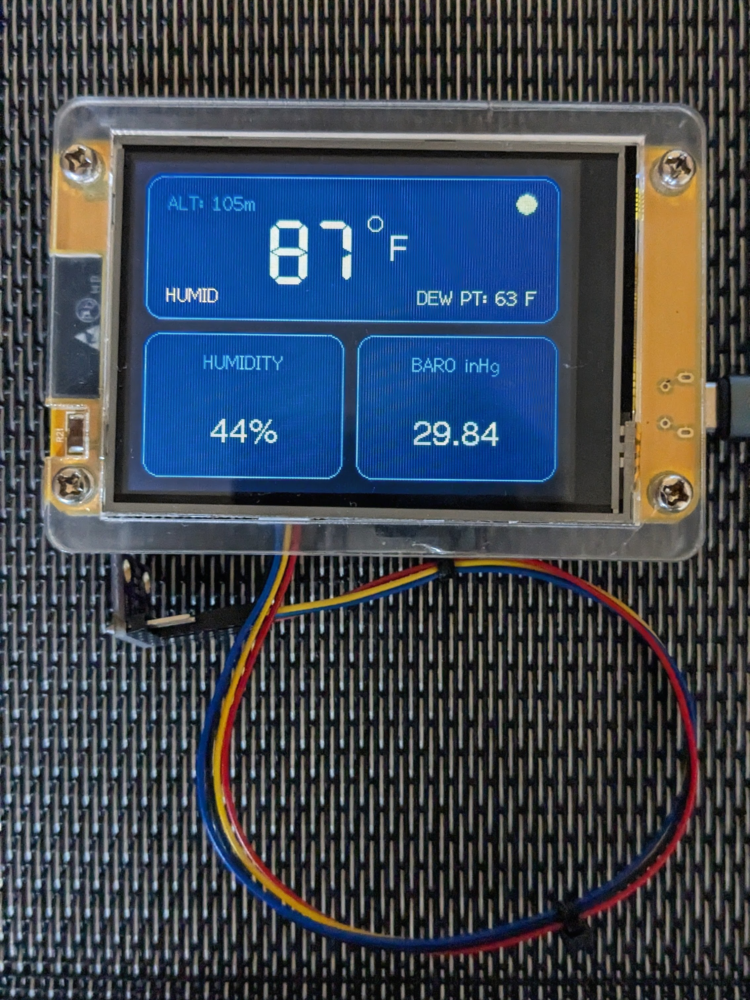
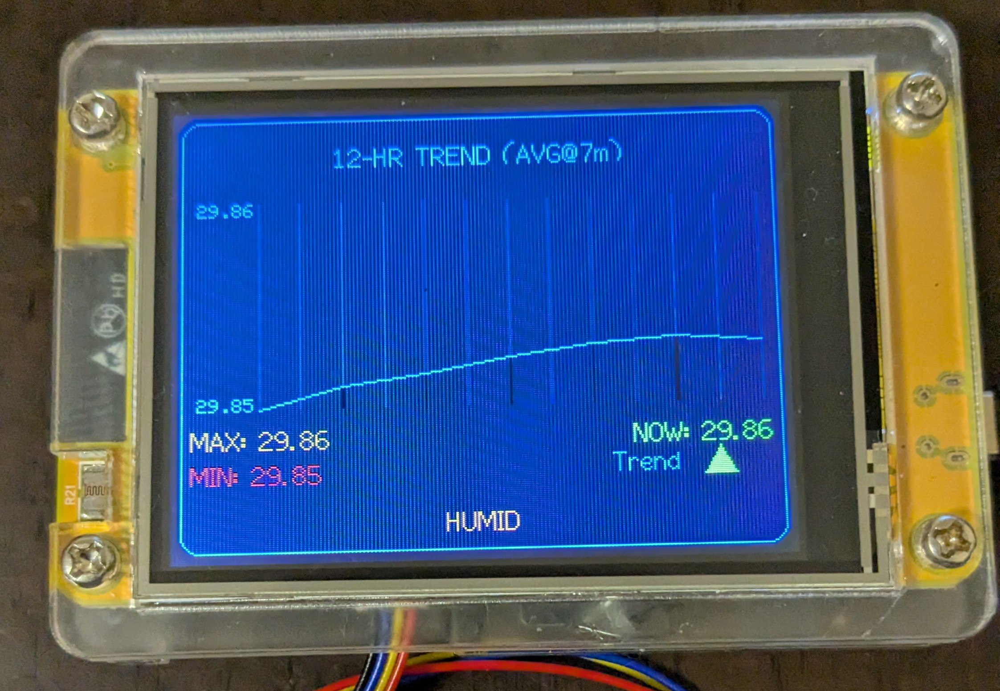

# ESP32 CYD Weather Station (v5.14)

A fast, lightweight weather station built for the **ESP32-2432S028 (CYD display)**.
Displays real-time environmental data with a clean dashboard and historical graphing.

---

## 📸 Screenshots

*(Add your images here)*

### Dashboard View



### Graph View



---

## 🌤️ Features

* Real-time readings:

  * Temperature
  * Humidity
  * Pressure
  * Dew Point
* Comfort level indicator
* Dual display modes:

  * Dashboard view
  * Graph view (historical data)
* Fast and smooth UI updates
* Optimized for long-term stability

  * No dynamic `String` usage
  * Uses fixed buffers (`snprintf`)
  * NaN sensor protection

---

## ⚡ Hardware Required

* ESP32-2432S028 (CYD display)
* BME280 environmental sensor (I2C)

---

## 📦 Libraries Required

Install via Arduino IDE Library Manager:

* TFT_eSPI
* Adafruit BME280
* Adafruit Unified Sensor

---

## 🖥️ TFT_eSPI Configuration (IMPORTANT)

⚠️ This project requires a custom TFT_eSPI setup for the CYD display.

---

### 📁 Option 1 (Recommended – Use Included File)

Copy this file into your TFT_eSPI library:

```
config/User_Setup_CYD.h
```

Then edit:

```
TFT_eSPI/User_Setup_Select.h
```

Add:

```cpp
#include <User_Setup_CYD.h>
```

---

### 📁 Option 2 (Manual Setup)

Create this file:

```
TFT_eSPI/User_Setup_CYD.h
```

Paste the following:

```cpp
#define USER_SETUP_INFO "CYD ESP32-2432S028"

#define ILI9341_DRIVER

#define TFT_WIDTH  240
#define TFT_HEIGHT 320

#define TFT_MISO 12
#define TFT_MOSI 13
#define TFT_SCLK 14
#define TFT_CS   15
#define TFT_DC    2
#define TFT_RST   4

#define TFT_BL   21
#define TFT_BACKLIGHT_ON HIGH

#define SPI_FREQUENCY  40000000

#define LOAD_GLCD
#define LOAD_FONT2
#define LOAD_FONT4
#define LOAD_FONT6
#define LOAD_FONT7
#define LOAD_FONT8
#define LOAD_GFXFF

#define SMOOTH_FONT
```

---

### 🧪 Verify Setup

Run this example from TFT_eSPI:

```
Read_User_Setup
```

Check Serial output to confirm correct configuration.

---

## 🔧 Installation

1. Clone or download this repository
2. Open the `.ino` file in Arduino IDE:

   ```
   CYD_Weather_Station/CYD_Weather_Station_ver5_14.ino
   ```
3. Select board:

   ```
   ESP32 Dev Module
   ```
4. Upload to your ESP32

---

## 🖥️ Display Modes

### Dashboard View

* Live sensor readings
* Clean layout
* Comfort indicator

### Graph View

* Historical trends
* Min/Max tracking
* Smooth scrolling updates

---

## 📈 Data Handling

* Rolling buffer stores recent readings
* Used for graph rendering
* Filters invalid sensor values (NaN protection)

---

## 🌡️ Units

Supports:

* Celsius (°C)
* Fahrenheit (°F)

Efficient conversion without extra memory usage.

---

## 🚀 Future Improvements

* WiFi connectivity (MQTT / HTTP)
* SD card logging
* Touchscreen UI
* Multiple sensor support

---

## 📄 License

Free to use, modify, and share.

---

## 🙌 Credits

Created as a hobby project focused on:

* ESP32 performance optimization
* Embedded UI design
* Reliable long-term operation

---
